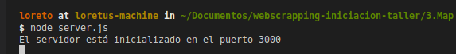

# EJEMPLO DE VISUALIZACIÓN DE DATOS

El objetivo de esta parte del taller es volcar en un mapa toda la información que hemos "scrapeado" en los pasos anteriores.

Como nuestro "bakground" es de GIS (Sistema de Información Geográfica) lo que os proponemos es crear un mapa e intentar "jugar" un poquito con los datos o si queréis ser más elegantes hacer "un análisis espacial de la información".

Obviamente para hacer ésto, necesitamos georrefenciar la información y por tanto, necesitamos las coordenadas.

Hay varias maneras de conseguirlas. Por ejemplo, podemos ayudarnos de un "Geocoder", un servicio de Geocodificación. 

Lo que hace este servicio es convertir una dirección postal en coordenadas geográficas que son las que usamos para marcar la posición en un mapa. Esto lo hacemos constantemente cuando buscamos una dirección en Google Maps, por ejemplo. 

Otra forma sería intentar acceder a la respuesta que devuelve este servicio de geoposicionamiento al marcar las posición en el mapa.

Esto es lo que hemos hecho en el paso anterior y lo que nos queda pendiente es relacionar los dos archivos json con la información a través de una propiedad que tienen en común.

Una vez que tengamos nuestros datos preparados el objetivo será levantarlos como un servicio y construir una pequeña aplicación que nos ayudará a visualizarlos. 

Ahora os contamos como lo hemos hecho.

**¡¡ Al turrón !!**

## Procedimiento tratamiento de datos:

1. **Analizar los datos** En primer lugar vamos a **analizar los datos** que tenemos. Por un lado tenemos un archivo .json con la información alfanumérica de los datos (alquiler-distrito-retiro-pacifico.json) y por otra lado la información geográfica (coordenadas-distrito-retiro-pacifico.json). Ambos archivos están en la carpeta **data**.

Si vemos un poco los datos de los dos archivos podemos ver que los conjuntos de objetos tiene la propiedad en común **id**, así que, por ahí vamos a relacionarlos.

3. **Trabajar con los datos**: hay muchas maneras de trabajar con nuestros datos pero en este caso vamos a crear una archivo *"tratamiendo-datos.js"* donde vamos a hacer todos nuestros *"experimentos"*:

    ```javascript
    const alquileres = require('./data/alquiler-distrito-retiro-pacifico.json');
    const coordinates = require('./data/coordenadas-distrito-retiro-pacifico.json');
    const COORDS_BY_ID = coordinates.reduce((old, cur, i, arr) => {
            old[cur.id] = cur;
            return old;
        }, {});
    const getCoords = (id) => {
        return COORDS_BY_ID.hasOwnProperty(id) ?
            COORDS_BY_ID[id] : { latitude: 0, longitude: 0 }
    }

    let data = alquileres
        .map(a => {
            let { latitude, longitude } = getCoords(a.id);
            let coords = [longitude, latitude];
            return {...a, coords }
        });
   ```

La variable *data* contiene toda la información que obtuvimos de manera independiente en el paso anterior, es decir, que en este archivo tenemos tendremos ya todos los datos unidos: la información alfanumérica y la espacial.

3. **Crear en al archivo .geojson**: Un archivo .geojson es un formato o estructura de datos que se utiliza para representar información geográfica. 

 ```javascript
 const fromArrayToGeoJSON = (arr) => {
    const geoJSON = {
        "type": "FeatureCollection",
        "features": []
    };
    const geoJsonFeatures = geoJSON.features;
    arr.map((el) => {
        geoJsonFeatures.push({
            "type": "Feature",
            "geometry": {
                "type": "Point",
                "coordinates": el.coords
            },
            "properties": el
        })
    });
    return geoJSON;
}

```
Para poder escribir este archivo vamos a ayudar de un módulo de NodeJs que se llama File-System y que tiene un montón de métodos para trabajar para manejar directorios.

```javascript
const fs = require('fs');
```
En nuestro caso vamos a utilizar el método *fs.writeFile()* que escribe o reemplaza un fichero y contenido:

```javascript
fs.writeFile('./data/.housting-distrito-retiro-pacifico.geojson', JSON.stringify(fromArrayToGeoJSON(data)), (err) => {
    if (err) console.log(err);
    console.log("Housting: Successfully Written to File.");
});

```
Para comprobar que nuestros datos tienen el formato correcto podremos ayudarnos de un [linter](http://geojsonlint.com/), donde podremos visualizar y verificar nuestros datos.

4. **Servir nuestros datos como un servicio de entidades**:

Una vez que tenemos nuestros datos preparadas, lo que necesitamos es levantarlos en un WebService para que nuestra aplicación pueda servirse de ellos.

Lo que vamos a hacer para esto en construir un pequeño servidor ayudándonos de Express.js, un framework de Node.js muy útil para construir aplicaciones en poco tiempo.

En nuestra terminal

 ```sh
 npm install express --save
 ```


Vamos a trabajar sobre el archivo *server.js*:

```javascript

const express = require("express");
const app = express();
const fs = require('fs');

const url = './data/housting-distrito-retiro-pacifico.json';
const data = fs.readFileSync(url, 'utf-8');
let geoData = JSON.parse(data);

app.get('/', (req, res) => {
    res.send( geoData);
  });

app.listen(3000, () => {
 console.log("El servidor está inicializado en el puerto 3000");
});

```
Iniciamos el servidor. Para ello escribimos en la terminal:

 ```sh
 node server.js
 ```
Si todo ha funcionado correctamente, nuestro servidor estará inicializdo en el puerot 3000, y en muestra consola apareceré el siguiente mensaje:



5. ***Estructura del proyecto de mapa**: Para poder visualizar estos datos vamos a crear una pequeña aplicación con los archivos necesarios. 
La estrucutura del proyecto será la siguiente, enlazaremos los archivos externos de Javascript y CCS:

```

   map
    ├── index.html
    ├── featureServer
    ├── css
        └── main.css
    ├── js
        ├── visualVariables.js
        ├── visualVariables.js
        └── withLegend.js 
    └── data
        └── alquileres-distrito-retiro-pacifico.json
        └── coordenadas-distrito-retiro-pacifico.json
```

6. **Creación de aplicación**: Utilizaremos el API de ArcGIS para Javascript de Esri. Para el uso de esta API se recomienda utilizar la versión alojada. Debemos referenciar a través del CDN que nos proporcionan. 
Colocamos en el <head> de nuestro archivo <html> lo siguiente:

  ```html
  <link rel="stylesheet" href="https://js.arcgis.com/4.11/esri/themes/light/main.css">
  <script src="https://js.arcgis.com/4.11/"></script>
  ```
Con esto, utilizaremos los estilos y los métodos de la API.

```html
<!DOCTYPE html>
    <html>
        <head>
            <meta charset="utf-8" />
            <meta name="viewport" content="initial-scale=1,maximum-scale=1,user-scalable=no"/>
            <title>Taller Iniciación al WebScrapping</title>
            <link rel="stylesheet" href="https://js.arcgis.com/4.11/esri/themes/light/main.css"/>
            <link rel="stylesheet" href="css/main.css"/>
            <script src="https://js.arcgis.com/4.11/"></script>

        </head>
        <body>
            <div id="viewDiv"></div>
            <script type="text/javascript" src="js/main.js"></script>
        </body>
    </html>

```

6. **Análisis espacial**: Durante el taller os explicaremos un "poquillo" en qué consiste esta API y como añadimos distintas funcionalidades.


7. **Visualización de datos**: Una vez construida nuestra aplicación, ya es momento de satisfacer nuestra curiosidad y de disfrutar de nuestro esfuerzo.
Vamos a ayudarnos de ```http-server ``` que es un paquete sencillito de Node.js que nos proporciona un servidor HTTP de línea de comando para servir archivos locales.

Abrimos otra terminal:

 ```sh
 npm install http-server --save

 ```
 Una vez, que tengamos nuestro paquete instalado, escribimos en la terminal:

 ```sh
http-server .
 ```


